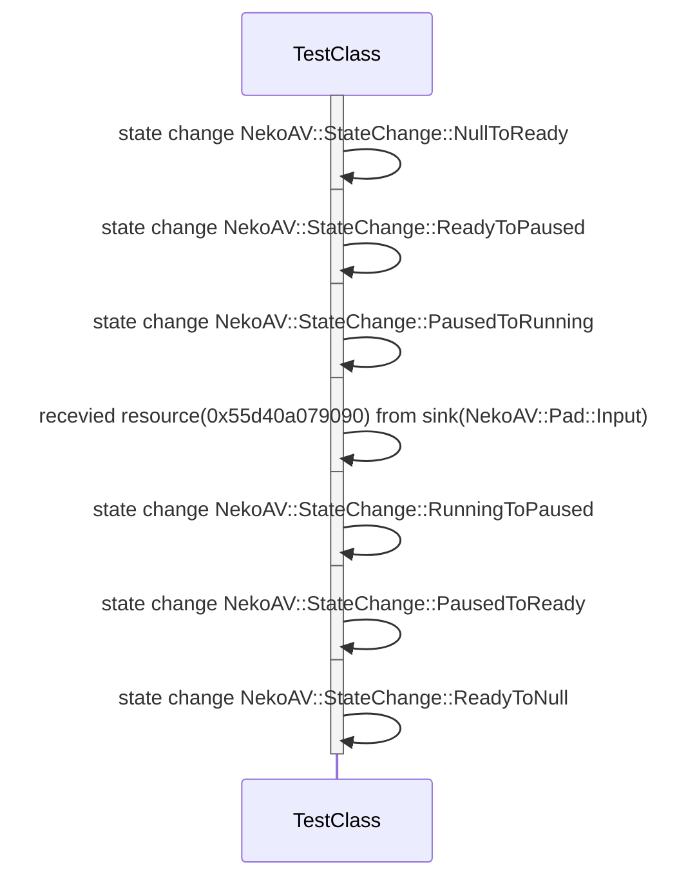

# A project to player video

```mermaid
sequenceDiagram
participant 140732095120704 as TestClass
activate 140732095120704
140732095120704->>140732095120704: state change NekoAV::StateChange::NullToReady
deactivate 140732095120704
activate 140732095120704
140732095120704->>140732095120704: state change NekoAV::StateChange::ReadyToPaused
deactivate 140732095120704
activate 140732095120704
140732095120704->>140732095120704: state change NekoAV::StateChange::PausedToRunning
deactivate 140732095120704
activate 140732095120704
140732095120704->>140732095120704: recevied resource(0x55d40a079090) from sink(NekoAV::Pad::Input)
deactivate 140732095120704
activate 140732095120704
140732095120704->>140732095120704: state change NekoAV::StateChange::RunningToPaused
deactivate 140732095120704
activate 140732095120704
140732095120704->>140732095120704: state change NekoAV::StateChange::PausedToReady
deactivate 140732095120704
activate 140732095120704
140732095120704->>140732095120704: state change NekoAV::StateChange::ReadyToNull
deactivate 140732095120704
```